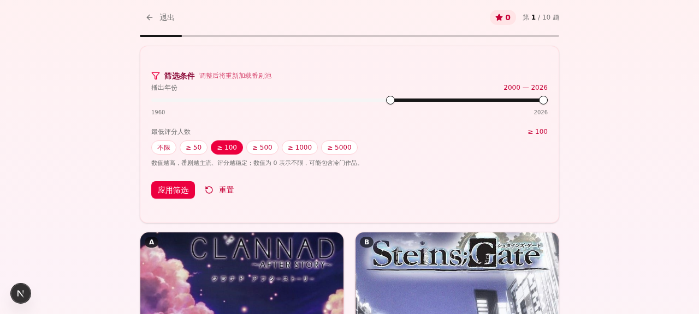
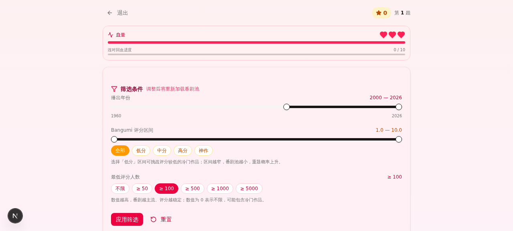
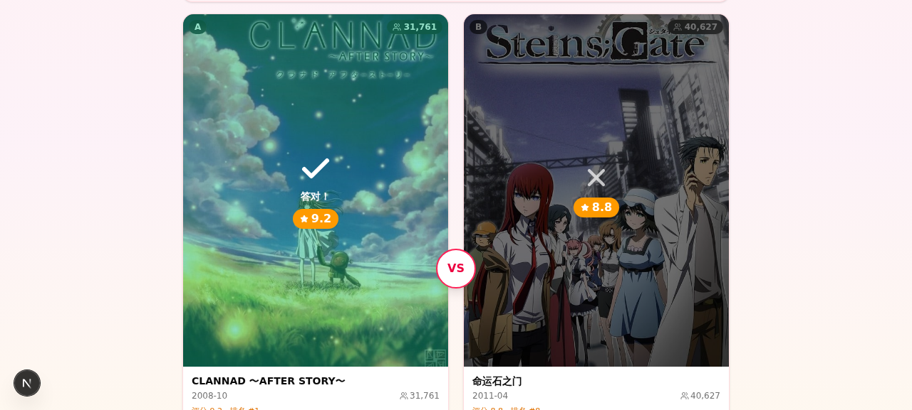

# 🎴 番剧评分对战 · Anime Battle

> 从 [Bangumi 番组计划](https://bgm.tv/) 实时获取番剧封面与评分，挑战你的眼力——选出评分更高的一部！  
> 单人血量制生存赛 + 好友联机对战，支持年份 / 评分区间 / 评分人数三维筛选。


---

## ✨ 功能特性

### 🩸 单人模式 · 血量制生存赛
- **初始 3 滴血**，顶部心形血条 + 回血进度副条
- **答错扣 1 滴血**，血量耗尽即结束（不再有回合上限）
- **每连对 10 题回 1 滴血**（不超出上限）
- **连击加成**：连续答对触发 +10 / +12 / +14… 累加得分
- 结算页显示存活题数、答对/答错、最高连击、准确率

### ⚔️ 多人联机模式
- Socket.io 实时对战，房主创建 6 位房间号，对手输入加入
- 双方看到同一对番剧，先答对得 **+5 速度加成**
- 共 10 题，结算最高分者胜
- 实时显示双方得分、思考中 / 已选择状态

### 🔗 链式对战机制（核心）
- **第 1 题**：随机抽取两部番剧 [A, B]
- **第 2 题起**：上题的 B 变为新的 A，再抽一个新 B 补位
- A 卡片左上角带「上题B 循环」徽章
- API 新增 `count=1` 模式，配合 `excludeId` 避免重题

### 🔍 三维筛选栏
- **播出年份范围**：1960 - 当前年份（双滑块）
- **Bangumi 评分区间**：1.0 - 10.0（5 个预设：全部 / 低分 / 中分 / 高分 / 神作）
- **最低评分人数**：不限 / ≥50 / ≥100 / ≥500 / ≥1000 / ≥5000
- 服务端 5 分钟内存缓存，避免重复调用 Bangumi API

### 🎨 视觉与交互
- 玫红 / 琥珀暖色系主题，避开蓝紫俗套
- Framer Motion 动画过渡（揭晓覆盖层、心形脉动、卡片悬停）
- 完全响应式，移动端单栏 / 桌面端双栏对照
- 评分揭晓前完全隐藏（连评分人数都不显示），避免暗示

---

## 📸 演示截图

### 单人对战界面


### 血量条 + 回血进度


### 答案揭晓


---

## 🛠️ 技术栈

| 类别 | 技术 |
|------|------|
| 框架 | Next.js 16 (App Router, Turbopack) |
| 语言 | TypeScript 5 |
| 样式 | Tailwind CSS 4 + shadcn/ui (New York) |
| 状态 | Zustand（客户端） / TanStack Query（服务端） |
| 动画 | Framer Motion |
| 实时通信 | Socket.io 4 |
| ORM | Prisma 6 + SQLite |
| 运行时 | Bun 1 |
| 数据源 | [Bangumi v0 API](https://bangumi.github.io/api/) |
| 反向代理 | Caddy 2（生产环境） |

---

## 🚀 快速开始

### 环境要求
- Node.js ≥ 20 或 Bun ≥ 1.1
- 服务器需能访问 `https://api.bgm.tv`（国内服务器通常没问题）

### 1. 克隆仓库

```bash
git clone https://github.com/NOSKANNE/animebbk.git
cd anime-battle
```

> ⚠️ 把 `NOSKANNE/animebbk` 替换为你实际的仓库路径。

### 2. 安装依赖

```bash
# 主项目
bun install

# 多人服务子模块
cd mini-services/multiplayer-service
bun install
cd ../..
```

### 3. 准备环境变量

```bash
echo "DATABASE_URL=file:$(pwd)/db/custom.db" > .env
mkdir -p db
bun run db:push
```

### 4. 启动开发服务器

```bash
# 启动 Next.js 主站（端口 3000）
bun run dev

# 另开一个终端启动多人服务（端口 3003）
cd mini-services/multiplayer-service
bun run dev
```

### 5. 访问应用

打开浏览器访问 `http://localhost:3000` 即可。

> 💡 本地开发时，多人模式 WebSocket 会通过 Next.js 内部代理访问 3003 端口，无需额外配置网关。

---

## 📁 项目结构

```
anime-battle/
├── src/
│   ├── app/
│   │   ├── page.tsx                 # 主页面（模式切换）
│   │   ├── layout.tsx               # 根布局
│   │   └── api/
│   │       └── bangumi/route.ts     # Bangumi API 代理（POST，支持 count=1/2）
│   ├── lib/
│   │   ├── bangumi.ts               # Bangumi 数据层 + 随机抽题
│   │   ├── game-store.ts            # Zustand 游戏状态（HP/连击/回血）
│   │   ├── db.ts                    # Prisma Client
│   │   └── utils.ts                 # 工具函数
│   ├── components/
│   │   ├── ui/                      # shadcn/ui 组件集
│   │   └── game/
│   │       ├── main-menu.tsx        # 主菜单
│   │       ├── single-player.tsx    # 单人血量制
│   │       ├── multiplayer.tsx      # 多人联机
│   │       ├── anime-card.tsx       # 番剧卡片
│   │       └── filter-bar.tsx       # 三维筛选栏
│   └── hooks/
│       ├── use-mobile.ts
│       └── use-toast.ts
├── mini-services/
│   └── multiplayer-service/
│       ├── index.ts                 # Socket.io 服务端
│       └── package.json
├── prisma/
│   └── schema.prisma                # 数据库 schema（暂未使用，可扩展为排行榜）
├── public/
│   └── logo.svg
├── docs/
│   └── screenshots/                 # README 截图
├── Caddyfile                        # 生产网关配置
├── package.json
├── next.config.ts
├── tailwind.config.ts
└── README.md
```

---

## 🌐 部署

### 关键架构

部署时需要 **三个组件** 协同工作：

```
浏览器 ── HTTPS ──► Caddy :443
                      │
                      ├─ XTransformPort=3003 查询参数 → 反代到 localhost:3003（Socket.io）
                      │
                      └─ 其他请求 → 反代到 localhost:3000（Next.js）
```

**为什么需要这种机制？**  
多人模式的 WebSocket 客户端写死了 `io('/?XTransformPort=3003')`，必须由网关根据查询参数转发到子服务端口。两个进程必须同机部署。

### 方案 A：VPS + PM2 + Caddy（推荐入门）

```bash
# 1. 构建
bun run build
bun build mini-services/multiplayer-service/index.ts \
  --outfile mini-services/multiplayer-service/dist.js \
  --target bun --minify

# 2. 用 PM2 启动两个进程
pm2 start "bun .next/standalone/server.js" --name anime-web
pm2 start "bun mini-services/multiplayer-service/dist.js" --name anime-mp
pm2 save && pm2 startup

# 3. 配置 Caddy（编辑 /etc/caddy/Caddyfile）
# animebbk.example.com { ... } 参考仓库根目录的 Caddyfile

sudo systemctl reload caddy
```

### 方案 B：Docker Compose（推荐生产）

仓库根目录已含 `Caddyfile`，可参考以下 `docker-compose.yml`：

```yaml
services:
  web:
    build: .
    ports: ["3000:3000", "3003:3003"]
    environment:
      - NODE_ENV=production
      - DATABASE_URL=file:/data/custom.db
    volumes: ["./db:/data"]
    restart: unless-stopped
  caddy:
    image: caddy:2
    ports: ["80:80", "443:443"]
    volumes: ["./Caddyfile:/etc/caddy/Caddyfile"]
    depends_on: [web]
    restart: unless-stopped
```

### 部署后验证

```bash
# 主站健康
curl https://animebbk.example.com/api/bangumi \
  -X POST -H "Content-Type: application/json" \
  -d '{"count":2,"yearStart":2020,"yearEnd":2024,"minRatingCount":100}'

# WebSocket 握手
curl -i "https://animebbk.example.com/?XTransformPort=3003&EIO=4&transport=polling"
# 期望：HTTP 200 + {"sid":"...","upgrades":["websocket"]}
```

---

## 🔧 配置项

### 环境变量

| 变量名 | 默认值 | 说明 |
|--------|--------|------|
| `DATABASE_URL` | `file:./db/custom.db` | Prisma SQLite 文件路径 |
| `NODE_ENV` | `development` | 生产环境设为 `production` |

### 调整游戏参数

修改 `src/lib/game-store.ts` 顶部的常量：

```ts
const DEFAULT_MAX_HP = 3;              // 初始血量
const HEAL_EVERY_N_CORRECT = 10;       // 连对几题回 1 血
```

修改单人模式得分公式在 `pick()` 函数内：

```ts
scoreDelta = 10 + Math.max(0, (nextStreak - 1) * 2);  // +10 基础 + 连击加成
```

### 调整多人模式规则

修改 `mini-services/multiplayer-service/index.ts`：

```ts
// 在 applyPicks 函数内：
delta = 10;            // 答对基础分
delta += 5;            // 先答对速度加成
delta = -3;            // 答错扣分
```

### Bangumi API 调用频率

`src/lib/bangumi.ts` 顶部：

```ts
const CACHE_TTL_MS = 1000 * 60 * 5;  // 5 分钟缓存
```

如遇 429 限流，可调长 TTL 或修改 `User-Agent`。

---

## 📡 API 参考

### `POST /api/bangumi`

抽取番剧数据，支持两种模式。

**请求体**

```ts
{
  yearStart?: number,      // 起始年份，如 2020
  yearEnd?: number,        // 结束年份，如 2024
  minRatingCount?: number, // 最低评分人数，如 100
  minScore?: number,       // 最低评分，1-10，默认 1
  maxScore?: number,       // 最高评分，1-10
  count?: 1 | 2,           // 抽取数量，默认 2（一对）
  excludeId?: number       // 当 count=1 时排除指定 id（链式模式用）
}
```

**响应（count=2）**

```json
{
  "pair": [
    { "id": 309311, "name": "...", "name_cn": "...", "score": 8.3, ... },
    { "id": 876, "name": "...", "name_cn": "...", "score": 9.2, ... }
  ],
  "poolSize": 87
}
```

**响应（count=1）**

```json
{
  "anime": { "id": 293049, "name": "...", "name_cn": "...", "score": 7.9, ... },
  "poolSize": 87
}
```

### Socket.io 事件（多人模式）

| 方向 | 事件 | 说明 |
|------|------|------|
| 客户端 → 服务端 | `room:create` | 房主创建房间 |
| 客户端 → 服务端 | `room:join` | 对手加入房间 |
| 客户端 → 服务端 | `game:start` | 房主开始游戏 |
| 客户端 → 服务端 | `game:pick` | 玩家选择番剧 |
| 客户端 → 服务端 | `game:next` | 房主进入下一题 |
| 服务端 → 客户端 | `room:state` | 房间状态全量同步 |
| 服务端 → 客户端 | `game:round` | 新一轮番剧对下发 |
| 服务端 → 客户端 | `game:pick` | 广播某玩家已选择 |
| 服务端 → 客户端 | `game:round_end` | 本轮揭晓 + 得分 |
| 服务端 → 客户端 | `game:end` | 游戏结束 + 最终分数 |

---

## 🎯 游戏规则速览

### 单人血量制
- 初始 **3 滴血**
- 答对：+10 分（连击 +2/级），连击累加
- 答错：扣 1 滴血，连击清零
- **每连对 10 题回 1 滴血**（不超出上限）
- 血量耗尽 → 结算页（存活题数 / 准确率 / 最高连击 / 评级）

### 多人竞速
- 共 10 题
- 答对：+10 分
- 先答对：额外 +5 速度加成
- 答错：-3 分
- 时间到（20s）未答：0 分，强制揭晓
- 10 题后总分高者胜

### 评级标准（单人结算）
| 存活题数 | 评级 |
|----------|------|
| ≥ 30 | 番剧鉴赏大师 |
| ≥ 20 | 资深老饕 |
| ≥ 10 | 不错的眼力 |
| ≥ 5 | 渐入佳境 |
| < 5 | 初出茅庐 |

---

## 🤝 贡献

欢迎提 Issue 和 PR！请先确保：

1. `bun run lint` 通过（0 errors）
2. 新增功能不要破坏既有筛选条件组合
3. 多人模式改动需同时测试主从两端

### 本地开发流程

```bash
# 启动 Next.js + 多人服务
bun run dev
cd mini-services/multiplayer-service && bun run dev

# 测试多人模式：另开终端跑模拟玩家
bun run scripts/join-as-second-player.ts <ROOM_ID> <NAME>
```

---

## 📜 数据来源与版权

- 所有番剧数据、封面图片均来自 [Bangumi 番组计划](https://bgm.tv/) 的 [v0 API](https://bangumi.github.io/api/)
- 本项目仅用于娱乐与学习，不存储任何番剧数据，所有封面通过 Bangumi CDN 实时加载
- 请遵守 Bangumi 的 [API 使用条款](https://github.com/bangumi/api/blob/master/docs-raw/common-1.md)，避免高频调用

---

## 📄 License

本项目基于 [MIT License](./LICENSE) 开源，可自由使用、修改、商用，请保留原作者版权声明。

番剧封面与评分数据版权归 Bangumi 与各版权方所有。
